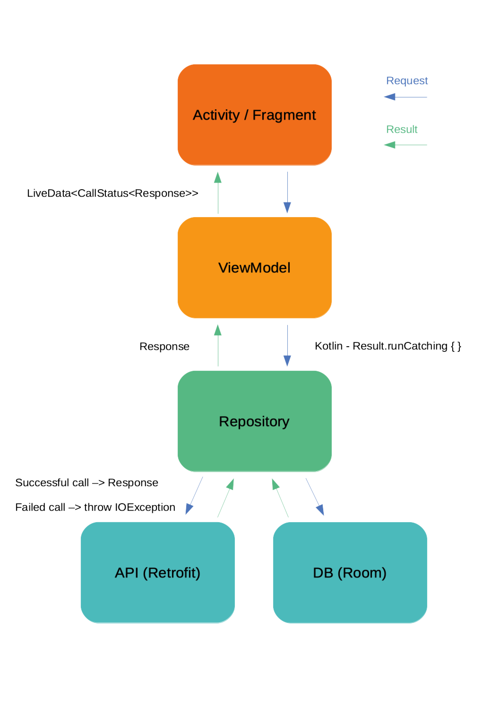

# Description
This sample app is the result of iterating in differents code challenges done on my last job search. My objective was not just to deliver a quality codebase but simple and readable, thereby reviewers could access it quickly.

I will be iterating on the JUnit tests as the coroutines and architecture components mature and with it, more reliable examples continue showing up.

# Development Environment

## Kotlin
The application is entirely written in Kotlin.

## Coroutines
It makes really simple handling multithreading and background task in Android.

## Koin
Kotlin dependency injection. With the latest update (version 2.0.0) it seems to be promising in terms of performance. For small and medium projects I think Koin could be the way to go, for larger projects maybe Dagger 2 could scale better.

# Architecture

The app is an Android Architecture Components(AAC) based using the MVVM pattern and repository pattern.

Architecture Components used:
* Android navigation component
* ViewModel
* LiveData
* Room

## Libraries used
* [Koin](https://insert-koin.io/)
* [Retrofit](https://square.github.io/retrofit/)
* [Gson](https://github.com/google/gson)
* [Okhttp3](https://github.com/square/okhttp)
* [Glide](https://github.com/bumptech/glide)
* [Mockito](https://developer.android.com/training/testing/unit-testing/local-unit-tests) / [Mockito-kotlin](https://github.com/nhaarman/mockito-kotlin)

## Plugins and tools used
* Json to Kotlin class plugin: plugin for Kotlin to convert Json String into Kotlin data class code quickly.
* Kotlin: the Kotlin plugin provides language support in IntelliJ IDEA and Android Studio.
* Material design Color Tool: with this tool, we can quickly export a Material Palette into a colors.xml file.
